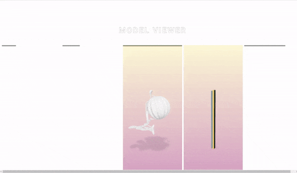
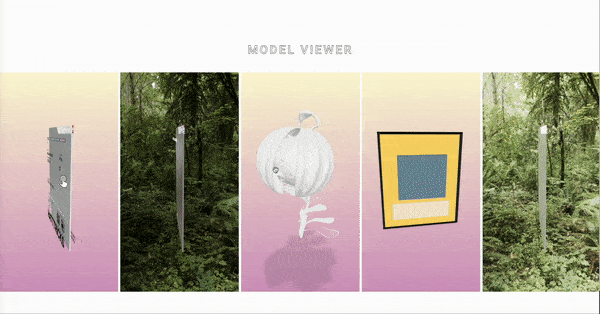
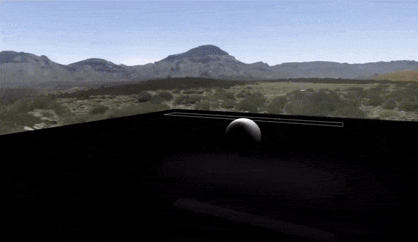
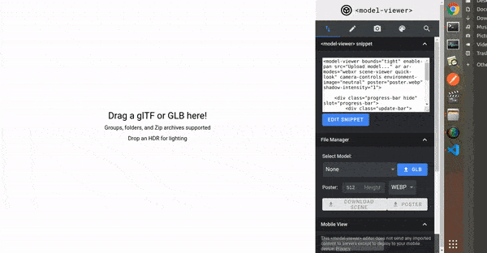
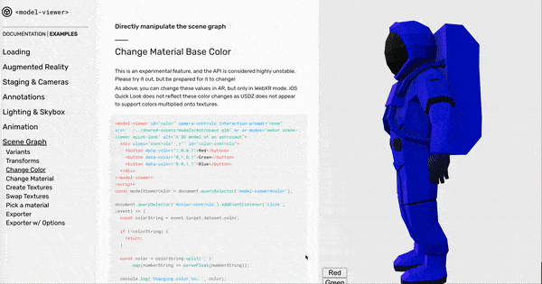
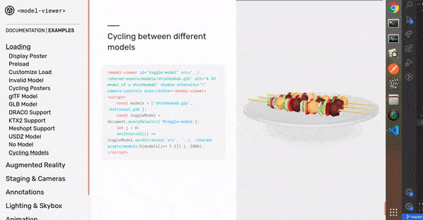
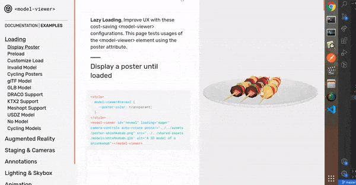

# Model-viewer

<br>

#### Still in progress / I will clean the code after I finish taking notes.

[sandbox default](./assets/sandbox/swap.md)

<br>
<br>

## ⚠️ Performance

<br>

<details>
<summary>Click to unfold</summary> 
   
<br>

#### I decided to put all the scenes together, to see how long it could actually take until the browser crashed.

<br>

- In **mac** its working nicely, perhaps a short lag when rendering for the first time (less than a millisecond) / chrome. I havent tested it in firefox/ mac, but for what I [saw / Browser Support](https://modelviewer.dev/), **its not supported**.

<br>

- But I ended up testing it in firefox / ubuntu.

<br>

[]()

> As you can see it takes some time to load

<br>

- In my ubuntu / chrome , **it crashes** if you try to rotate the models before it has finished loading, then after 2 seconds, you will see the page fully loaded (in the first 2 seconds the models show with some sort of **grain** around it but the grain disappears after its finishes loading).

<br>

- In my ubuntu / Firefox , **it works better than chrome**, takes a bit until it works with normality.
  (it has the same **grain** issue when loading)

<br>
<br>

> ⚠️ There is a lot to uncover here: the size of the images, the size of models, lights, textures etc contribute a lot in the weight of each scene.

<br>
   
   
   
</details>

  <br>
  <br>

---

  <br>
  <br>

## Basic attributes & Animation

##### (camera, zoom, lights, shadow, sky-box img, env images )

[]()

<br>

## Lights

<details>
<summary>Click to unfold</summary> 
   
<br>

- I think it s a great **API**, but for me there is not enough **documentation or community** to dive more into it, and it s sad because the API makes 3d visualization so easy.

<br>

> **The problem with not having more options:** just imagine you have a crazy idea involving lights of all sorts, here you have this (with the incorporated lighting that I think we have no way to touch):

```javascript
exposure = oscillate(0, 2,
```

> ⚠️ But It's still too early to tell, maybe I am missing something? perhaps there is a possibility to incorporate similar lights to the ones **threejs** offers:

<br>

##### three js lights examples

[](https://youtu.be/T6PhV4Hz0u4)

<br>

#### ⚠️ Conclusion

<details>
<summary>Click to unfold</summary> 
   
<br>

#### I guess for now we have the oscillate, neutral and the baked lights.

<br>

( ⚠️ update: read the section update under this block of code )

```javascript
exposure = oscillate(0, 2,
```

#### from:

```javascript
<model-viewer camera-controls id="exposure-demo" exposure="1" skybox-image="../../shared-assets/environments/spruit_sunrise_1k_HDR.hdr" alt="A 3D model of a sphere reflecting a sunrise at varying exposure" src="../../shared-assets/models/reflective-sphere.gltf"></model-viewer>
<script>
(() => {
  const modelViewer = document.querySelector('#exposure-demo');
  const time = performance.now();

  const animate = (now) => {
    modelViewer.exposure = oscillate(0, 2, 4000, now - time);
    requestAnimationFrame(animate);
  };

  animate();
})();
</script>

```

<br>

#### Or this which is really interesting:

> **Documentation:** Showing the difference between our two baked-in lighting environments
> If no environment or skybox is specified, we have a baked-in default scene that is faster to load. It is designed primarily for frontward viewing, but there is also a baked-in neutral lighting environment that is evenly lit on all sides, and can be activated by setting environment-image="neutral". <br><br> This lighting has also been roughly calibrated to render colors at nearly their **baseColorMap RGB** values. You may find the neutral lighting to be more pleasing than the default when using auto-rotate, as shown here, or when object does not have a clear front side.

<br>

```javascript
<model-viewer id="neutral-demo" camera-controls auto-rotate environment-image="neutral" alt="A 3D model of a kitchen mixer" src="../../assets/ShopifyModels/Mixer.glb">
  <label for="neutral">Neutral Lighting: </label>
  <input id="neutral" type="checkbox" checked="true">
</model-viewer>
<script>
(() => {
  const modelViewer = document.querySelector('#neutral-demo');
  const checkbox = document.querySelector('#neutral');

  checkbox.addEventListener('change',() => {
    modelViewer.environmentImage = checkbox.checked ? 'neutral' : '';
  });
})();
</script>
```

<br>

## Update 🦖

##### I just found this editor

- For what i see, it gives you a lot of options related to the materials/textures, lights and more. It s a very useful tool and I hope they don't discontinued it.

#### [editor ](https://modelviewer.dev/editor/)

<br>

[]()

<br>

</details>

<br>

</details>

<br>

---

## Events

<details>
<summary>Click to unfold</summary> 
   
<br>

- In this section you will not only learn how to change the colors but also: materials, textures, normals, occlusion, emission...

<br>

[]()

<br>

#### [Change Material Base Color](https://modelviewer.dev/examples/scenegraph/#swapTextures)

> ⚠️ This is an experimental feature, and the API is considered highly unstable. Please try it out, but be prepared for it to change!

<br>
<br>

#### [Swap textures](https://modelviewer.dev/examples/scenegraph/#swapTextures)

As above, you can change these values in AR, but only in WebXR mode. iOS Quick Look does not reflect these color changes as ⚠️ **USDZ does not appear to support colors multiplied onto textures.**

<br>

</details>

<br>

---

### Lazy loading & and different formats

<details>
<summary>Click to unfold</summary> 
   
<br>

#### The Lazy Loading

[Read more | Documentation ](https://modelviewer.dev/examples/loading/)

<br>

- Easy to use for basic projects but I don't know how good this can be if the page is being loaded by many at the same time.

<br>

- **Comparing to threejs**, I dont know how reliable the **easy loading** provided by **model-viewer** can be, but there must be a way to handle it with functions like with threejs (to load depending of how many models we have on the page).

<br>

> But i think its a bad thing already, if the user has to wait until all the models are loaded, Unless you have some sort of video or something the user can watch, while the scenes are loading( just an idea)

<br>

#### More about this:

[preload](https://modelviewer.dev/examples/loading/#preload)

<br>

</details>
<br>
<bt>

---

<br>

#### More

#### [Cycling between different models](https://modelviewer.dev/examples/loading/#cyclingModels)

<details>
<summary>Click to unfold</summary>

<br>

```html
<model-viewer
  id="toggle-model"
  src="../../shared-assets/models/shishkebab.glb"
  alt="A 3D model of a shishkebab"
  shadow-intensity="1"
  camera-controls
  auto-rotate
></model-viewer>
```

```html
<script>
  const models = ["shishkebab.glb", "Astronaut.glb"];
  const toggleModel = document.querySelector("#toggle-model");
  let j = 0;
  setInterval(
    () =>
      toggleModel.setAttribute(
        "src",
        `../../shared-assets/models/${models[j++ % 2]}`
      ),
    2000
  );
</script>
```

<br>

[](https://modelviewer.dev/examples/loading/)

<br>

## Draco

<br>

- As you can see there is a way to integrate the **Draco compression for the models** (I still need to test it)

<br>

[](https://modelviewer.dev/examples/loading/)

<br>

</details>

<br>

---

# AR

#### [Augmented Reality : Attributes](https://modelviewer.dev/docs/#augmentedreality-attributes)

##### (I still need to test it)

###### [are-ar-nfts-the-next-big-thing/](https://artlabs.ai/blog/are-ar-nfts-the-next-big-thing/)

<br>

---

<br>

### Interesting links

<details>
<summary>Click to unfold</summary>

<br>

[vectary](https://www.vectary.com/)

[sayduck](https://sayduck.com/)

[Crypto Art, Augmented Reality & Virtual Reality Art ](https://www.youtube.com/watch?v=4TJhLoFqd0U)

[Implement 3D Easily with Google's model-viewer](https://www.youtube.com/watch?v=8uMBmfzgjN0)

 </details>
